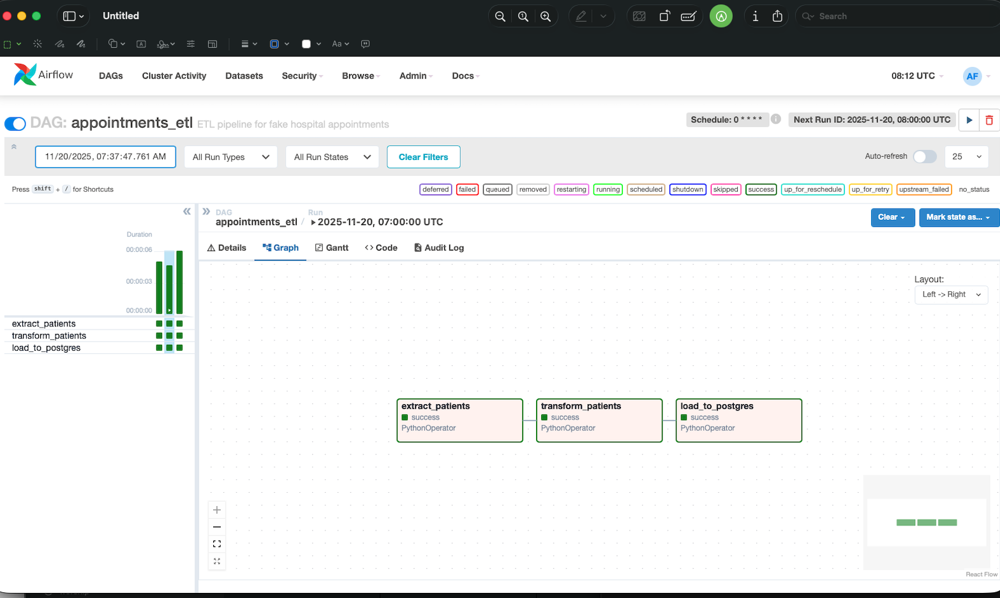

# Health Appointments ETL with Airflow & PostgreSQL

Dockerized Airflow + Python ETL that ingests fake hospital data from an API, generates synthetic appointments, and loads analytics tables into PostgreSQL. Includes a Power BI dashboard for provider performance and no-show insights.


Simple portfolio project that shows how to:
- Orchestrate an ETL pipeline with **Apache Airflow**
- Ingest fake "patient" data from an external **HTTP API**
- Transform it into synthetic **appointments**
- Load into **PostgreSQL** for analytics
- Expose a clean `fact_appointments` table for BI tools (e.g. Power BI)

## Architecture

1. **Extract**  
   Airflow calls a Python function that hits a fake API (`fakerapi.it`) to fetch patient records.

2. **Transform**  
   We enrich the data with synthetic appointment info (doctor, specialty, status, start/end time).

3. **Load**  
   Data is loaded into PostgreSQL:
   - `stg_patients`
   - `fact_appointments`
   # Health Appointments ETL (Airflow + PostgreSQL + Docker)
   
   A fully dockerized **Apache Airflow + Python ETL pipeline** that ingests synthetic patient data from an external API, generates fake hospital appointments, and loads clean analytics tables into **PostgreSQL (`healthdb`)**.  
   Includes optional **Power BI** dashboards for provider performance and no-show analysis.
   
   This is a simple, clean, and realistic **portfolio project** demonstrating orchestration, ETL design, and warehouse modeling.
   
   ---
   
   ## 🚀 What this project demonstrates
   
   - Orchestrating an end-to-end ETL pipeline using **Apache Airflow**
   - Fetching synthetic patient data from an external **HTTP API** (`fakerapi.it`)
   - Transforming raw records and generating synthetic **appointments**
   - Loading cleaned and modeled data into **PostgreSQL**
   - Designing a small warehouse with **staging** and **marts**
   - Supplying clean data for **BI dashboards** (Power BI)
   
   ---
   
   ## 🧱 Architecture Overview
   
   The pipeline consists of three Airflow tasks:
   
   ### **1. Extract**
   Fetch patient data via:
   ```
   GET https://fakerapi.it/api/v1/persons
   ```
   
   ### **2. Transform**
   - Patient normalization  
   - Appointment generation (doctor, specialty, timestamp, status)
   
   ### **3. Load**
   Loads data into the analytics database **healthdb**:
   
   **Schemas & tables**
   - `staging.stg_patients`
   - `marts.fact_appointments`
   - `marts.vw_appointments_by_doctor`
   
   ---
   
   ## 📊 Airflow DAG — Graph View
   
   
   
   ---
   
   ## 🧩 Architecture Diagram (Mermaid)
   
   ```mermaid
   flowchart LR
       subgraph Airflow ["Apache Airflow DAG"]
           A[extract_patients\nPythonOperator]
           B[transform_patients\nPythonOperator]
           C[load_to_postgres\nPythonOperator]
       end
   
       subgraph API ["External API"]
           X[(fakerapi.it)]
       end
   
       subgraph Warehouse ["PostgreSQL - healthdb"]
           subgraph Staging
               S1[staging.stg_patients]
           end
           subgraph Marts
               M1[marts.fact_appointments]
               M2[marts.vw_appointments_by_doctor]
           end
       end
   
       X --> A
       A --> B
       B --> C
       C --> S1
       C --> M1
       M1 --> M2
   ```
   
   ---
   
   ## 📂 Project Structure
   
   ```
   .
   ├── dags/
   │   └── appointments_etl_dag.py
   │
   ├── etl/
   │   ├── api_client.py
   │   ├── transform.py
   │   ├── load.py
   │   └── config.py
   │
   ├── sql/
   │   ├── staging/
   │   └── marts/
   │
   ├── docker/
   │   └── initdb/
   │       └── 01-create-healthdb.sql
   │
   ├── docker-compose.yml
   └── README.md
   ```
   
   ---
   
   ## 🧪 Running Locally (Docker)
   
   ### 1. Start the stack
   ```bash
   docker compose up -d
   ```
   
   ### 2. Open Airflow
   ```
   http://localhost:8080
   user: airflow
   pass: airflow
   ```
   
   ### 3. Validate the load
   Use psql:
   
   ```sql
   SELECT COUNT(*) FROM staging.stg_patients;
   SELECT COUNT(*) FROM marts.fact_appointments;
   ```
   
   ---
   
   ## 📊 Power BI Dashboard (Optional)
   
   Connect using:
   - Server: localhost  
   - DB: healthdb  
   - User: airflow  
   - Password: airflow
   
   ---
   
   ## 💡 Why this project matters
   
   This repo demonstrates real-world data engineering concepts such as:
   
   - Airflow orchestration  
   - Modular Python ETL  
   - API ingestion  
   - Warehouse modeling (staging → marts)  
   - Dockerized infra  
   

4. **Schedule & Monitor**  
   An Airflow DAG (`appointments_etl`) runs hourly, with retries and basic logging.

## Tech stack

- Apache Airflow 2.x
- Python 3.x
- PostgreSQL
- `pandas`, `requests`, `sqlalchemy`

## Running locally (Docker)

```bash
docker-compose up -d
